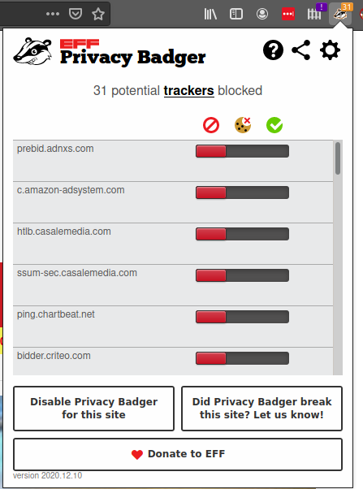

title: Mozilla Firefox

Firefox is fast & secure browser and one of the few competitors to the blink engine & Chrome.

# Firefox Profiles

One of my favourite features is profiles, using firefox -p you can create/select different profiles. This is useful if you want to keep shopping and general surfing separately. It also allows you to keep different extensions in each profile.

# Plugins

## Facebook containers

[https://addons.mozilla.org/en-GB/firefox/addon/facebook-container/](https://addons.mozilla.org/en-GB/firefox/addon/facebook-container/)

Like profiles, facebook containers can segment your browsing. This is useful to allow you to sign in to the same website with multiple accounts. This can be useful with CTF's as well as using a normal user account and admin account at the same time in Azure/O365 for example. Facebook Containers also helps block facebook from tracking you around the web.

## Privacy Badger

[https://addons.mozilla.org/en-GB/firefox/addon/privacy-badger17/](https://addons.mozilla.org/en-GB/firefox/addon/privacy-badger17/)

Privacy Badger is great addon to block trackers. This can also prevent some adverts from loading which can help performance and save bandwidth.

## FoxyProxy

[https://addons.mozilla.org/en-GB/firefox/addon/foxyproxy-standard/](https://addons.mozilla.org/en-GB/firefox/addon/foxyproxy-standard/)

This is a must CTF's and using BURP, OWZAP etc... allows easy switching between using a different proxies and none at all.

## Cookies.txt

[https://addons.mozilla.org/en-GB/firefox/addon/cookies-txt/](https://addons.mozilla.org/en-GB/firefox/addon/cookies-txt/)

This is a great little addon for CTF's again, you can save your cookies as text file that can used with curl or youtube-dl for example.

## User Agent Switcher

[https://addons.mozilla.org/en-GB/firefox/addon/user-agent-string-switcher/](https://addons.mozilla.org/en-GB/firefox/addon/user-agent-string-switcher/)

Another useful one, sometimes you need to change your useragent string when doing CTF's. Sometimes though, even when there appears to be no reason developers will limit functionality to certain browsers ( IE/Edge etc ), a simple switch of the UA and you get the full features.