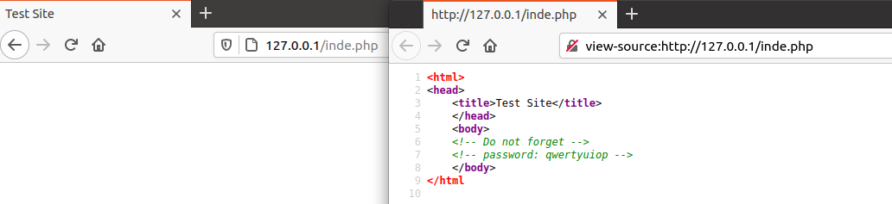

title: Web Exploit Notes

# Robots.txt
`robots.txt` is a common file found webservers. This file is meant to instruct web crawlers such as `Google` not to index certain pages. More information can be found on [wikipedia's article for robots.txt](https://en.wikipedia.org/wiki/Robots_exclusion_standard). 

```
# robots.txt for http://www.wikipedia.org/ and friends
#
# Please note: There are a lot of pages on this site, and there are
# some misbehaved spiders out there that go _way_ too fast. If you're
# irresponsible, your access to the site may be blocked.
#

# Observed spamming large amounts of https://en.wikipedia.org/?curid=NNNNNN
# and ignoring 429 ratelimit responses, claims to respect robots:
# http://mj12bot.com/
User-agent: MJ12bot
Disallow: /

# advertising-related bots:
User-agent: Mediapartners-Google*
Disallow: /
```

# View-Source
Using ***View Page Source*** in the browser or `curl` from the command line can reveal `html` comments in the webpage which may provide useful information

```html
╰─⠠⠵ curl http://127.0.0.1/inde.php 
<html>
<head>
	<title>Test Site</title>
	</head>
	<body>
	<!-- Do not forget -->
	<!-- password: qwertyuiop -->
	</body>
</html
```

Firefox & Chrome you can pre-pend the URL with `view-source:`




# Mirroring a website

Sometimes it can be useful to mirror a website locally, this can be done using `wget`

```
╰─○ wget -m -k --no-parent https://example.com/
--2021-03-07 01:34:44--  https://example.com/
Resolving example.com (example.com)... 93.184.216.34, 2606:2800:220:1:248:1893:25c8:1946
Connecting to example.com (example.com)|93.184.216.34|:443... connected.
HTTP request sent, awaiting response... 200 OK
Length: 1256 (1.2K) [text/html]
Saving to: ‘example.com/index.html’

example.com/index.html                     100%[=======================================================================================>]   1.23K  --.-KB/s    in 0s      

2021-03-07 01:34:45 (22.4 MB/s) - ‘example.com/index.html’ saved [1256/1256]

FINISHED --2021-03-07 01:34:45--
Total wall clock time: 0.5s
Downloaded: 1 files, 1.2K in 0s (22.4 MB/s)
Converting links in example.com/index.html... nothing to do.
Converted links in 1 files in 0 seconds.
```
The above flags I use by default basically create a local version of the website.

```
-m / --mirror
    Turn on options suitable for mirroring.  This option turns on recursion and time-stamping, sets infinite recursion depth and keeps FTP directory listings.
It is currently equivalent to -r -N -l inf --no-remove-listing.

--no-parent
    Do not ever ascend to the parent directory when retrieving recursively.  This is a useful option, since it guarantees that only the files below a certain
hierarchy will be downloaded.  

-k / --convert-links
    After the download is complete, convert the links in the document to make them suitable for local viewing.  This affects not only the visible hyperlinks, but any part of the document that links to external content, such as embedded images, links to style sheets, hyperlinks to non-HTML content, etc.
```